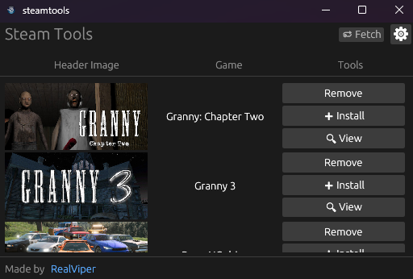

# 🧰 Steamtools

**Steamtools** is a lightweight tool written in **Rust** that allows you to easily **view, install, and remove Lua Manifests**.

---

## 🗓️ TODO

- [x] Add header image for Lua Manifests  
- [x] Add tool: Remove  
- [x] Add tool: Install  
- [x] Add tool: Uninstall  
- [X] Add tool: View  
- [X] Add Window: Settings (experimental)

---

## ⚙️ Planned Side Features

- [X] Add MelonModLoader support
- [X] Add Lua Plugin support
  - [X] Basic Support (1 active running plugin)
  - [X] Code Editor (supports syntax highlighting)
  - [ ] Being able to run more then 1 script (on diffrent threads)

---

**Language:** Rust 🦀
**Status:** In active development 🚀

