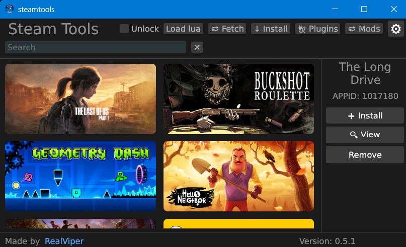

<h1 align="center">🧰Steamtools</h1>

  
  
  
  
  

<!-- 

 -->

**Steamtools** is a lightweight tool written in **Rust** that allows you to easily **view, install, and remove Lua Manifests**. The source code of the proxy dll: xinput1_4.dll is currently not available since I only ship the binary for it. May **change** in  the **future** !

---

## 🗓️ TODO

- [x] Add header image for Lua Manifests  
- [x] Add tool: Remove  
- [x] Add tool: Install  
- [x] Add tool: Uninstall  
- [X] Add tool: View  
- [X] Add Window: Settings
- [X] Search Bar
- [ ] Moving Mod, Plugins buttons down a bit for more space
- [ ] Improving Settings by adding (Start, Restart, Close Steam)

---

## ⚙️ Planned Side Features

- [X] Add MelonModLoader support
- [X] Add Lua Plugin support
  - [X] Basic Support (1 active running plugin)
  - [X] Code Editor (supports syntax highlighting)
  - [ ] Being able to run more then 1 script (on diffrent threads)
- [ ] Better Visuals

---

## Donating

Since this is a personal project and I invest my free time in making this you could support me by donating!
SOL: GYepZXvMAyQ8y54HuWx8QR3yBBg9EFEqn7dDJo93GbTM (SOL Network)

## Prerequisites

- VC_Runtime: [x64](https://aka.ms/vs/17/release/vc_redist.x64.exe)
- Opengl Drivers:
  - [AMD](https://www.amd.com/en/support/download/drivers.html)
  - [NVIDIA](https://www.nvidia.com/de-de/drivers/)

**Language:** Rust 🦀
**Status:** In active development 🚀

### v0.2.1 Steamtools App

### v0.5.1 GUI Rework

